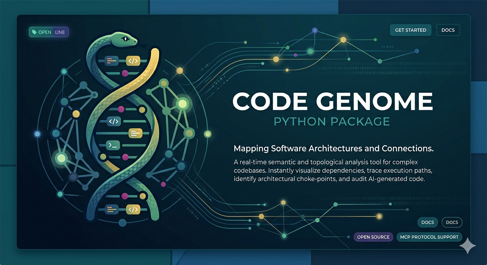
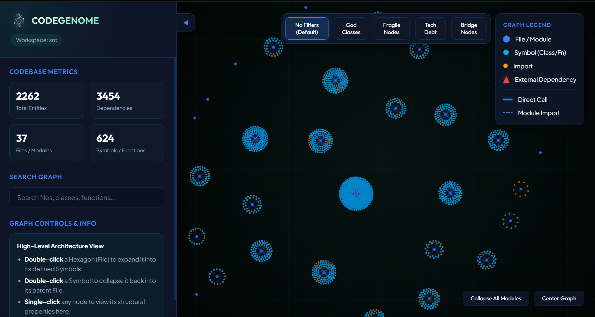
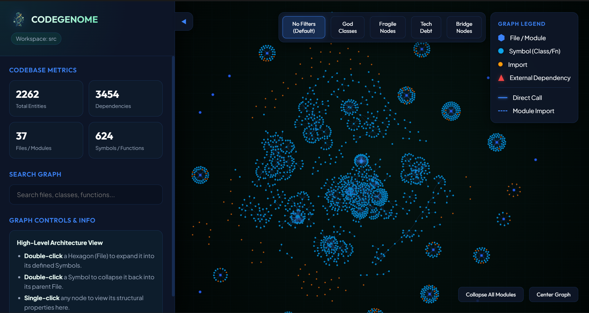
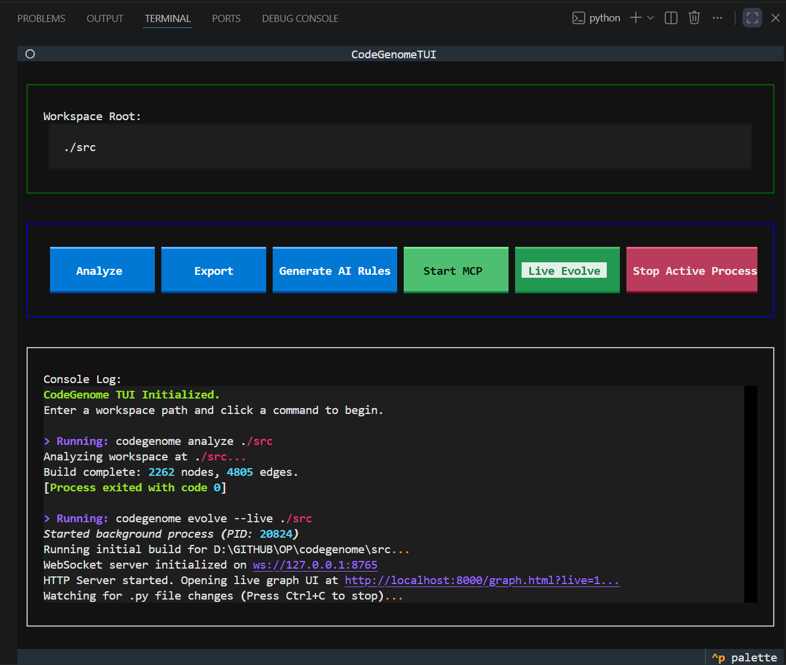

<div align="center">
  

  <br />

  <h1>Codegenome</h1>

  <p>
    <strong>Open-source CLI for building, exporting, and querying local codebase knowledge graphs.</strong>
  </p>

  <p>
    <a href="https://github.com/Ogro-Projukti/codegenome/actions"></a>
    <a href="https://pypi.org/project/codegenome/"></a>
    <a href="LICENSE"></a>
  </p>
</div>

---

**Codegenome** scans your repository, extracts symbols and relationships using `tree-sitter`, stores timeline snapshots in SQLite, and exposes this powerful intelligence to AI agents through MCP (Model Context Protocol). Use it headless in CI, on servers, or alongside any editor—no VS Code required!

## ✨ What Codegenome Can Do

### 🧠 Codebase Intelligence & Graph Building
Codegenome deeply understands your code. It parses your source files, incrementally builds a knowledge graph, and outputs structured intelligence. Whether you're querying for dependencies or analyzing churn, Codegenome provides the structural truth of your codebase.

### ⚡ Live Graph Visualization & Watch Mode
Keep your codebase intelligence fresh in real-time. As you write code, Codegenome watches your workspace and automatically updates the graph, so your agents and queries are never out of sync.

<div align="center">
  
  
</div>

### 🖥️ Rich Terminal User Interface (TUI)
Interact with your codebase's architecture and timeline effortlessly through our built-in terminal UI. Explore connections and insights without ever leaving your terminal. **For the best and most intuitive user experience (UX), we highly recommend using the TUI.**

To launch the TUI, simply run:
```bash
codegenome tui
```

<div align="center">
  
</div>

### 🤖 Seamless AI Agent Integration via MCP
Codegenome doesn't just build graphs; it acts as an intelligence server for your AI agents (Cursor, Claude, Copilot, etc.). Via HTTP or stdio transport, it serves as a high-fidelity context provider.

### 📤 Versatile Exports
Need your graph in a different format? Codegenome seamlessly exports to:
- **JSON**
- **HTML & Markdown**
- **GraphML**
- **Cypher** (for Neo4j)
- **Obsidian** (for personal knowledge bases)

## 🚀 Quick Start

Get up and running in seconds.

```bash
# Install via pip
pip install codegenome

# Build your first graph in any project directory
cd /path/to/your/project
codegenome analyze .

# Export your graph
codegenome export --format obsidian --path .

# Run in watch mode with LAN live graph sharing
codegenome evolve --live --lan .
```

> **Note**: For detailed CLI reference, installation guides, and MCP setup, see our comprehensive [Documentation](#-documentation).

## 🛠️ Troubleshooting

### 1. "No graph found" or Missing Database
**Symptom:** When attempting to run the MCP server (`codegenome mcp-start`) or export the graph (`codegenome export`), you receive an error that no graph was found or `.genome/watcher.db` does not exist.
**Solution:** Codegenome needs to build its initial knowledge graph database before it can be served or exported. Always run `codegenome analyze .` in your workspace first to generate the graph.

### 2. "unrecognized arguments" CLI Error
**Symptom:** You try to run commands and receive an `unrecognized arguments` error (e.g., mixing `--workspace` flags with `export` subcommands).
**Solution:** The unified CLI (`codegenome`) uses modern subcommands (e.g., `codegenome analyze .`, `codegenome mcp-start`, `codegenome tui`). If you are following older documentation that uses flags like `--workspace . --build`, you must invoke the Python module directly using `python -m codegenome --workspace . --build`. Avoid mixing the modular subcommands with the legacy flag-based CLI.

## 📚 Documentation

| Doc | Description |
|-----|-------------|
| 📖 [CLI reference](docs/cli-reference.md) | Flags, workflows, troubleshooting |
| ⚙️ [Installation](docs/installation.md) | pip, venv, MCP setup |
| 🔌 [MCP integration](docs/mcp-integration.md) | Server modes and client installer |
| 🧩 [Extensions](extensions/README.md) | Cursor rules and Copilot templates |

## ⚖️ License

Codegenome is open-source software licensed under the **[MIT License](LICENSE)**.

<div align="center">
  <br />
  
</div>
