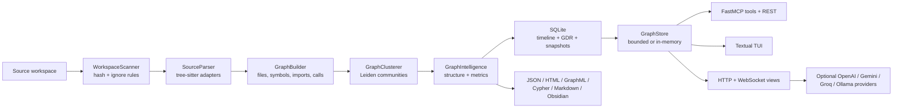
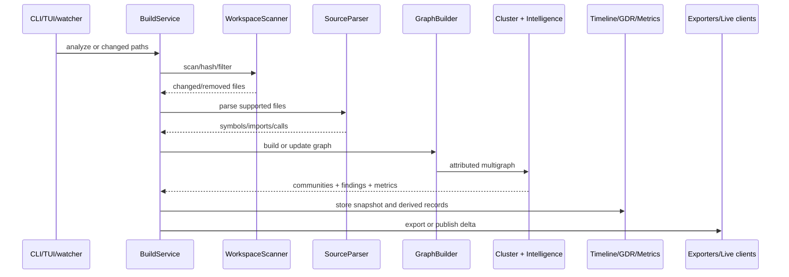

# Architecture overview

> **TL;DR:** CodeGenome is a Python pipeline that scans a workspace, parses supported languages with tree-sitter, builds an attributed multigraph, computes architectural intelligence, persists timeline/GDR/metric data in SQLite, and serves multiple human and agent interfaces. The decomposition is generally clear, but some supposedly progressive endpoints reload the full graph and persistence currently violates multigraph semantics.

## System context

The product’s stated intent is to expose repository structure to humans and AI agents (`README.md:8-33`). The executable implementation follows that model: `BuildService` coordinates scan, parse, build, clustering, intelligence, snapshots, GDR/metrics, and export (`src/codegenome/engine/build_service.py:22-103`), while `CodeGenome` is a thin facade over focused services (`src/codegenome/core.py:1-39`).

## Major architectural layers

| Layer | Responsibility | Primary evidence |
|---|---|---|
| Workspace | Resolve `.genome`, exports, database, and component lifetimes | `src/codegenome/engine/context.py:19-75` |
| Discovery | Walk files, apply ignores, hash contents, maintain scan cache | `src/codegenome/scanner.py:70-96`, `src/codegenome/scanner.py:204-292` |
| Language analysis | Choose grammar/extractor and create parsed symbols/imports/calls | `src/codegenome/parser/__init__.py:42-80`, `:93-190` |
| Graph construction | Create deterministic file/symbol/import/proxy IDs and typed edges | `src/codegenome/builder.py:14-36`, `:49-126`, `:137-282` |
| Graph abstraction | Support NetworkX and igraph with igraph as the normal backend | `src/codegenome/graph_api.py:1-479` |
| Clustering/intelligence | Leiden communities, bridges, complexity, coupling, cycles, dead code, churn | `src/codegenome/clusterer.py:31-106`; `src/codegenome/intelligence/` |
| Persistence | Snapshot graph/timeline, dependency records, precomputed global metrics, MCP activity | `src/codegenome/timeline.py:805-839`; `src/codegenome/gdr_store.py:12-56`; `src/codegenome/snapshot_metrics.py:13-26` |
| Serialization | Karyotype summaries, helix graphs, structure trees, nucleotide semantics, health | `src/codegenome/serializers/genome_provider.py:70-150`; `src/codegenome/serializers/health_aggregator.py:24-181` |
| Delivery | CLI, Python service, MCP, REST, WebSocket, TUI, static exports | `src/codegenome/cli.py:14-280`; `src/codegenome/service.py:1-94`; `src/codegenome/live_session.py:93-176` |

## Build and update flow

Incremental updates reuse file hashes and rebuild changed graph portions (`src/codegenome/scanner.py:204-292`, `src/codegenome/builder.py:76-126`). Full analysis is still required to refresh snapshot-wide metrics after large structural changes; the repository’s own capability note says patch snapshots may retain stale global metrics (`update-doc/memory-bounded-storage-current-capabilities.md:247-263`).

## Important architectural decisions

| Decision | Actual implementation | Rationale/effect | Assessment |
|---|---|---|---|
| Tree-sitter parsing | Per-language extractors under `parser/languages/` | Fast, syntax-aware, cross-language extraction without language runtimes | Sound |
| Attributed multigraph | File/symbol/import/proxy nodes; `contains`, `imports`, `inherits`, `calls` edges | Preserves architectural and call relationships | Sound in memory; persistence bug breaks parallel edges |
| igraph + Leiden | `leidenalg.find_partition`, deterministic seed 42 (`src/codegenome/clusterer.py:87-99`) | Scalable communities and stable results | Sound; differs from older fast-greedy plan |
| SQLite local state | `.genome/codegenome.db` stores all snapshots and derived data | Portable, single-user, offline-first operation | Practical; needs migrations, integrity enforcement, retention |
| Memory-bounded MCP | Empty resident graph plus on-demand file/neighborhood queries (`src/codegenome/graph_store.py:734-779`) | Avoid loading the complete graph for common tool calls | Valuable, but genome REST calls `graph_for_genome`, which loads the full snapshot (`src/codegenome/graph_store.py:753-761`; `src/codegenome/genome_routes.py:61-80`) |
| Multiple delivery surfaces | Modern Click CLI, legacy argparse CLI, TUI, MCP, HTTP/WS, files | Broad compatibility and adoption paths | Creates contract/documentation drift |

## Runtime and trust boundaries

- **Local repository boundary:** scanner/parser process arbitrary checked-out source. Tree-sitter analysis is non-executing, reducing code-execution exposure.
- **Local state boundary:** `.genome` contains repository structure, historical snapshots, MCP activity, and optional AI credentials/config (`src/codegenome/ai_chat.py:414-427`, `:619-628`).
- **Network boundary:** MCP HTTP defaults to loopback and requires an explicit remote option (`src/codegenome/mcp_server.py:84-197`), but the live visualization HTTP server currently does not honor the same boundary (`src/codegenome/live_session.py:266-272`).
- **External AI boundary:** chat context derived from local graph/code metadata may be sent to configured providers (`src/codegenome/ai_chat.py:191-220`). This is a product privacy boundary and should be explicit in UI/docs.

## Architectural pressure points

- Graph snapshot metrics rank `GraphStore` and `GenomeProvider` among the most complex/coupled components; TUI has the strongest cohesion/concentration warning. **Confidence: medium** because these are static graph heuristics, not runtime defect proof.
- The graph reports a cycle between `mcp_analysis.py` and `graph_store.py`; source inspection shows `TYPE_CHECKING` and local exception imports (`src/codegenome/mcp_analysis.py:17-18`, `:39-52`), so runtime risk is low. **Confidence: high.**
- The snapshot labels 19 dead-code candidates, including tests and public helpers. Treat those as review leads, not removal instructions. **Confidence: medium.**
