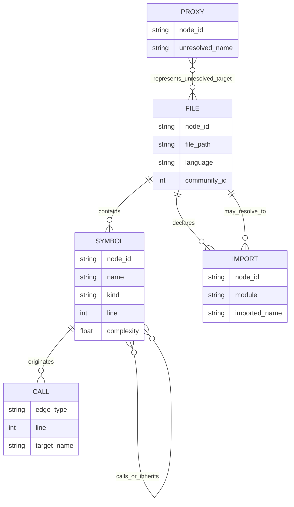
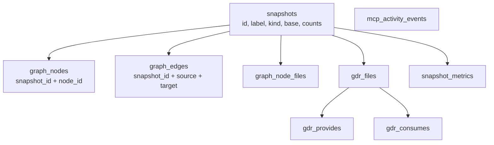
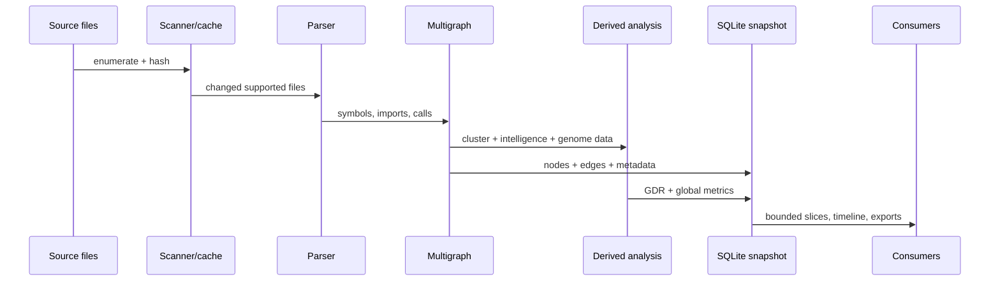

# Data model and data flow

> **TL;DR:** CodeGenome’s canonical model is an attributed directed multigraph with snapshot-scoped SQLite persistence plus file dependency and precomputed-metric tables. The current relational edge key omits edge identity, so persistence silently collapses parallel relationships and can no longer reconstruct the graph represented by snapshot metadata or JSON exports.

## Conceptual graph model

Node IDs are deterministic strings for files, symbols, imports, and proxies (`src/codegenome/builder.py:14-36`). The builder adds `contains`, `imports`, `inherits`, and `calls` relationships from parsed units (`src/codegenome/builder.py:137-282`). Multiple call/import relationships between the same endpoints are valid in memory, making edge identity part of the effective contract.

## SQLite physical model

| Table group | Purpose | Evidence |
|---|---|---|
| `snapshots`, `graph_nodes`, `graph_edges`, `graph_node_files` | Versioned graph and file lookup | `src/codegenome/timeline.py:805-839` |
| `gdr_files`, `gdr_provides`, `gdr_consumes` | Snapshot-scoped file dependency registry | `src/codegenome/gdr_store.py:12-56` |
| `snapshot_metrics` | Precomputed global intelligence payloads | `src/codegenome/snapshot_metrics.py:13-26` |
| `schema_meta` | Simple component schema version values | created by persistence components |
| `mcp_activity_events` | MCP call timing, status, summarized args/error | `src/codegenome/mcp_activity.py:16-35`, `:81-104` |

Audit command evidence: `.genome/codegenome.db` was 4,195,618,816 bytes and contained 648 snapshots. Snapshot 1 was full with 3,637 nodes/7,379 metadata edges; snapshot 648 was full with 5,756 nodes/10,507 metadata edges, while its relational rows were 5,756 nodes/8,085 edges. `PRAGMA foreign_keys` returned `0`.

## Analysis-to-storage flow

Full builds construct the graph and derived products in memory before persistence (`src/codegenome/engine/build_service.py:22-103`). In memory-bounded steady state, file subgraphs and neighborhoods come from SQLite (`src/codegenome/graph_store.py:763-830`); global results come from stored snapshot metrics. Patch builds copy global metrics until the next full analyze (`update-doc/memory-bounded-storage-current-capabilities.md:251-259`).

## Confirmed multiedge integrity defect

**Fact:** snapshot metadata records `graph.number_of_edges()` (`src/codegenome/timeline.py:143-150`), but persistence deduplicates edges in a dictionary keyed only by `(source, target)` (`src/codegenome/timeline.py:163-171`). The database primary key likewise contains only `snapshot_id`, `source_id`, and `target_id` (`src/codegenome/timeline.py:821-827`).

The audit performed an isolated round trip with two `calls` edges from `a` to `b` at different source lines: the input and snapshot metadata both reported 2 edges, while reload returned 1 edge containing only the later attributes. The current exported fallback graph has 10,507 edge instances but only 8,014 unique source-target pairs, demonstrating that parallel edges are common rather than hypothetical.

**Impact:** timeline reloads, bounded queries, historical comparisons, GDR/metric recomputation, and downstream agents may receive a graph materially different from the analyzed/exported one. **Severity: high; confidence: high.**

**Recommendation:** add an `edge_id` or deterministic multiedge key to `graph_edges`, include it in the primary key, remove pairwise dictionary deduplication, write a schema migration/rebuild path, and enforce round-trip invariants for nodes, edge count, edge attributes, and parallel-edge order/identity.

## Schema evolution and retention

- Persistence uses `CREATE TABLE IF NOT EXISTS` plus component values in `schema_meta`; no general migration framework was found. **Judgment:** this is adequate for an alpha prototype but risky once users retain long-lived databases.
- Foreign-key clauses exist in schemas, but the audited connection had enforcement disabled. No current orphan was established; this is a dormant integrity control gap, not a confirmed corruption finding.
- No snapshot deletion, age/count retention, compaction, or database-size budget was found. The repository’s own capability note confirms per-snapshot GDR copying and no cross-snapshot deduplication (`update-doc/memory-bounded-storage-current-capabilities.md:261-263`).
- At 648 snapshots and 4.2 GB for this repository, local state growth is already operationally material. **Recommendation:** expose retention by count/age/storage budget, compact transactionally, and document backup/recovery.

## Sensitive data classification

The graph stores paths, symbol names, imports, call targets, attributes, history, and tool activity—valuable internal architecture even without source bodies. Optional AI configuration persists provider keys in `.genome/ai-chat.json` (`src/codegenome/ai_chat.py:414-427`, `:619-628`). `.genome` is Git-ignored (`.gitignore:19-20`), but state should still be treated as confidential workstation data.
