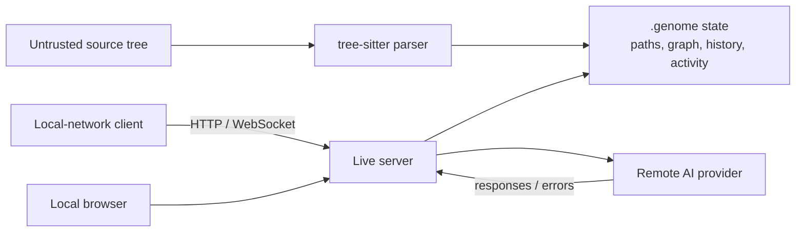

# Security review

> **TL;DR:** The dominant security issue is unintended default network exposure of unauthenticated live graph and AI routes; dependency resolution adds several high/medium published advisories. No committed secret was found, but local API-key storage, key-in-URL requests, upstream error propagation, and absent request/origin limits require hardening before non-loopback use.

## Severity-ranked findings

### SEC-01 — default live HTTP exposure without authentication

- **Severity:** High
- **Fact:** non-LAN mode computes a loopback `bind_host` (`src/codegenome/live_session.py:211-213`) but passes an empty HTTP host (`:266-272`), which the audit reproduced as `0.0.0.0`.
- **Fact:** handlers expose graph/static resources, AI settings, provider model lookup, and chat without authentication (`src/codegenome/live_session.py:93-176`).
- **Impact:** another host on a reachable interface may inspect repository architecture, trigger provider calls, or access settings; actual reachability depends on OS firewall/network topology.
- **Remediation:** explicit loopback bind by default; explicit `--lan` warning/consent; authentication token, origin/Host validation, TLS guidance, rate and body limits; security regression test.
- **Confidence:** high.

### SEC-02 — requirements resolve packages with known advisories

- **Severity:** High
- **Fact:** isolated resolution/audit found 11 advisory records across FastMCP 2.12.5, MCP 1.16.0, and pytest 8.4.2. The themes include command injection, OAuth consent/token handling, DNS rebinding, principal verification, WebSocket host/origin validation, XSS, and temp-directory handling.
- **Impact:** varies by platform/transport/feature; local HTTP and Windows execution paths overlap the project’s supported modes.
- **Remediation:** reconcile manifests and upgrade to a resolution containing all fixes; add automated audit and minimum-safe constraints. Full advisory links and version caveats are in [`07-DEPENDENCIES.md`](./07-DEPENDENCIES.md).
- **Confidence:** high for the audited resolution, medium for any unknown deployed environment.

### SEC-03 — AI credentials and repository context cross weak boundaries

- **Severity:** Medium
- **Fact:** API keys are persisted in `.genome/ai-chat.json` (`src/codegenome/ai_chat.py:414-427`, `:619-628`); permission hardening is best-effort and ignores failure.
- **Fact:** Gemini authentication is included in the request URL (`src/codegenome/ai_chat.py:145-157`), increasing exposure to proxy/history/error logs.
- **Fact:** graph-derived local context is included in remote chat requests (`src/codegenome/ai_chat.py:191-220`).
- **Impact:** credentials or proprietary architecture metadata can leak through local permissions, logs, proxies, screenshots, provider retention, or compromised browser clients.
- **Remediation:** OS keychain/credential store, header-based auth, redaction, explicit egress consent/context preview, provider allowlist, configuration-permission validation, and documented deletion.
- **Confidence:** high.

### SEC-04 — WebSocket and HTTP resource controls are absent

- **Severity:** Medium
- **Fact:** live WebSocket accepts subscriptions and broadcasts without application authentication or visible origin/rate/schema limits (`src/codegenome/live_server.py:33-116`).
- **Fact:** HTTP POST handling reads caller-supplied `Content-Length` without a maximum (`src/codegenome/live_session.py:173-176`).
- **Impact:** cross-origin/local-network abuse and memory/worker exhaustion, especially after SEC-01 or intentional LAN mode.
- **Remediation:** token handshake, origin/Host allowlist, strict Pydantic message models, size/time/rate/concurrency limits, connection caps, and abuse tests.
- **Confidence:** high for missing controls; medium for exploitability behind an OS firewall.

### SEC-05 — diagnostics expose sensitive local metadata

- **Severity:** Low–medium
- **Fact:** MCP health includes the absolute database path and activity exposes recent tool activity (`src/codegenome/mcp_tools/routes.py:24-55`). Activity stores argument summaries and errors in SQLite (`src/codegenome/mcp_activity.py:81-104`); summarization truncates rather than semantically redacts (`:312-327`).
- **Impact:** filesystem names, query terms, node IDs, and error text may reveal repository/user context to an HTTP client or local-state reader.
- **Remediation:** minimize health payloads, authenticate diagnostic routes, redact known sensitive keys/paths, configure retention, and make activity opt-in for HTTP exposure.
- **Confidence:** high.

### SEC-06 — rules generator can corrupt policy/instruction files

- **Severity:** Medium (integrity)
- **Fact:** generated rules overwrite entire targets (`src/codegenome/rules.py:87-95`).
- **Impact:** security instructions or agent guardrails in `AGENTS.md`/editor rules can be removed, even without a malicious actor.
- **Remediation:** bounded managed blocks, atomic writes, diff/confirmation, backups, and content-preservation tests.
- **Confidence:** high.

## Existing controls

- MCP HTTP defaults to `127.0.0.1`, and remote HTTP requires an explicit allow flag (`src/codegenome/mcp_server.py:36-50`, `:84-197`). Keep this model and apply it consistently to live mode.
- Source analysis parses code rather than executing the target workspace.
- `.genome` and `.env` are ignored (`.gitignore:19-27`), limiting accidental Git commits.
- AI config attempts mode `0600` (`src/codegenome/ai_chat.py:619-628`). This is useful on POSIX but should not be treated as cross-platform ACL enforcement.
- MCP tool calls use guarded envelopes/activity tracking, helping diagnosis, though redaction/retention need work.

## Secret and supply-chain review

Tracked filename and keyword searches found no committed credential, private key, or token. This is a best-effort repository scan, not proof that Git history, releases, developer machines, or external systems never contained secrets; no secret value was copied into this report.

Supply-chain controls not found: locked/hash-verified dependencies, automated dependency updates, dependency review, SBOM, provenance attestations, artifact signing, release workflow, and binary checksum publication. GPL dependency obligations are a licensing/release concern documented in [`07-DEPENDENCIES.md`](./07-DEPENDENCIES.md), not classified here as a vulnerability.

## Threat model summary

The most credible path is local-network/browser access to a mistakenly exposed service, followed by metadata disclosure or provider-call abuse. Arbitrary target-source execution was not found in the core parse path, so it is a lower concern than network configuration and dependency behavior.

## Verification plan

After remediation, run binding tests on Windows/Linux/macOS, browser cross-origin tests, oversized/slow request tests, dependency audit against the release lock, credential-redaction tests, and a focused local-network penetration test of both MCP HTTP and live HTTP/WS modes.
