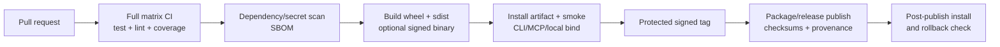

# CI/CD, operations, and observability

> **TL;DR:** The repository has a small cross-platform compatibility workflow but no complete CI quality gate, release/publish automation, deployment model, rollback procedure, or production observability stack. Operational behavior is currently appropriate for a local alpha tool only if network exposure and state-growth risks are explicitly controlled.

## Continuous integration

The single tracked workflow triggers on `main` pushes and pull requests, with Ubuntu/macOS and Python 3.11–3.13 (`.github/workflows/compatibility.yml:1-28`). It installs the package and pytest, then runs parser tests, CLI help, and an import smoke test (`:29-41`).

| Control | Current state | Required state |
|---|---|---|
| Full tests | Not run | all tests on each PR |
| Lint/format | Not run | Ruff blocking; formatter policy explicit |
| Coverage | Not measured | publish report, ratcheting floor |
| Supported OS | Linux/macOS | add Windows |
| Package verification | CLI/import smoke only | build sdist/wheel, install artifacts, smoke all commands |
| Dependency/security | None | audit, secret scan, dependency review, SBOM |
| UI/server integration | None | socket/HTTP/WS and representative TUI tests |
| Test artifacts | None | JUnit, coverage, audit/SBOM outputs |

The current workflow would not detect four of the five confirmed bugs in [`09-BUGS-AND-FAILURE-MODES.md`](./09-BUGS-AND-FAILURE-MODES.md), nor the seven Ruff failures.

## Branch and review controls

Read-only GitHub API evidence on 2026-07-20 found no repository rulesets, and the `main` branch-protection endpoint returned 404. PRs #2–#5 are merged; PR [#6](https://github.com/Ogro-Projukti/codegenome/pull/6) is open and has no checks.

**Judgment:** Require pull requests, at least one review, passing full CI, conversation resolution, and protection from force-push/deletion on `main`. Add CODEOWNERS for persistence/security/release-sensitive paths once real ownership is agreed; do not infer owners from commit count alone.

## Delivery and release

| Area | Observed state |
|---|---|
| Package metadata | version 0.1.4, alpha classifier, setuptools (`pyproject.toml:1-24`) |
| Git tags | none |
| GitHub releases | none |
| Publish workflow | none |
| Binary build | local `build_cli.py`/PyInstaller helper only |
| Artifact signing/checksums | none |
| Changelog/release notes | release-oriented docs exist, but no canonical changelog automation |
| Deployment definitions | no Dockerfile, Compose, Kubernetes, Terraform, serverless, or service manifests tracked |
| Rollback | not documented |

The branch has 16 commits not in `main`, while package version remains 0.1.4 (`pyproject.toml:7`; `src/codegenome/version.py:3`). Project URLs point to `codegenome-dev/codegenome` rather than the audited GitHub remote (`pyproject.toml:55-59`). Correct metadata and establish version/tag/artifact invariants before the first formal release.

## Recommended release pipeline

Use trusted publishing/OIDC where a registry supports it; avoid long-lived publish tokens. Release only from a protected tag whose version equals both package version sources and whose artifacts were built by the tested workflow.

## Runtime operations

CodeGenome is primarily a user-operated local process:

- `analyze` is batch work and writes `.genome` plus exports;
- `evolve` runs watcher + HTTP + WebSocket processes;
- `mcp-start` runs stdio or HTTP and owns a `GraphStore`/timeline connection;
- TUI can coordinate analysis/live modes;
- optional AI requests leave the machine.

No runbook defines process supervision, ports, resource limits, log rotation, database backup/restore, snapshot retention, corruption recovery, certificate setup, or incident response. For a local CLI these can be concise, but the 4.2 GB audited state and network modes make them necessary.

## Observability

| Signal | Current implementation | Gap |
|---|---|---|
| Logs | Python logging; MCP structured JSON helper (`src/codegenome/mcp_runtime.py:21-24`) | no documented levels/sinks/rotation/redaction |
| Health | MCP `/health` (`src/codegenome/mcp_tools/routes.py:24-37`) | exposes DB path; no readiness distinction |
| Activity | SQLite MCP events with timing/status (`src/codegenome/mcp_activity.py:16-35`) | local only; retention/redaction absent |
| Graph status | TUI/live view and snapshot metadata | no SLA/SLO, no alerting |
| Metrics/tracing | architectural metrics, not operational telemetry | no request/process/memory/disk metrics or distributed tracing |

Suggested local operational metrics: build duration, scanned/changed files, snapshot/node/edge row and metadata counts, DB bytes/growth, peak RSS, query duration, WS connections, rejected/failed requests, provider latency/error category, and metrics freshness. Do not include source symbols, file paths, prompts, keys, or provider bodies by default.

## Recovery and rollback priorities

1. Back up or atomically copy the database before schema migration/compaction.
2. Add `codegenome doctor` checks for schema version, integrity, edge-count invariant, free disk, and config permissions.
3. Make analysis outputs rebuildable from source; document which activity/AI settings are not reconstructible.
4. Provide snapshot retention/compaction with dry-run and transactional rollback.
5. Define release rollback as reinstalling the prior signed artifact plus schema compatibility guarantees.
