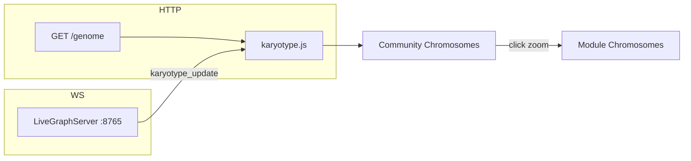

# Session 3: Karyotype Frontend & Real-Time Pipeline

This document records the Level 1 Karyotype view: the frontend scaffold, Leiden community clustering in the UI, and WebSocket-driven live mutations.

## Goal

Render the top-level genome view and connect it to the real-time WebSocket pipeline so architectural changes appear on the Karyotype grid as they happen.

## Architecture



| Layer | Responsibility |
|-------|----------------|
| `GenomeProvider.build_summary()` | Lightweight module summaries with health, community, and A/T/G/C counts |
| `GET /genome` | Initial Karyotype load (served by live session HTTP handler and MCP routes) |
| `LiveGraphServer` | Broadcasts `karyotype_update` to clients subscribed at `level: "karyotype"` |
| `karyotype.{html,css,js}` | Renders the grid, handles zoom, applies live DOM patches and animations |

## Backend contract

### `GET /genome`

Returns a `GenomeSummaryResponse`:

```json
{
  "modules": [
    {
      "module_id": "src/codegenome/serializers",
      "gene_count": 5,
      "health_score": 0.9467,
      "community_id": 12,
      "base_counts": { "A": 35, "A*": 0, "T": 22, "G": 28, "C": 217 }
    }
  ],
  "snapshot_id": 42
}
```

| Field | Meaning |
|-------|---------|
| `module_id` | Package path derived from source files |
| `gene_count` | Number of source files in the module |
| `health_score` | 0.0–1.0 aggregate module health |
| `community_id` | Dominant Leiden community (from file-node annotation) |
| `base_counts` | Nucleotide tallies: A (functions), A* (abstract/interface), T (classes), G (imports), C (calls) |

### WebSocket: `karyotype_update`

Clients subscribe on connect:

```json
{ "action": "subscribe", "level": "karyotype" }
```

Server pushes patches when files change during live evolution:

```json
{
  "type": "karyotype_update",
  "modules": [
    {
      "module_id": "core",
      "gene_count": 3,
      "health_score": 0.91,
      "community_id": 2,
      "base_counts": { "A": 10, "A*": 0, "T": 4, "G": 8, "C": 55 }
    }
  ],
  "snapshot_id": 43
}
```

## Frontend files

| File | Role |
|------|------|
| `src/codegenome/assets/html/karyotype.html` | Page shell, stats bar, breadcrumb, grid container |
| `src/codegenome/assets/html/karyotype.css` | Dark theme, cards, health bar, pulse animation |
| `src/codegenome/assets/html/karyotype.js` | Fetch, render, zoom, WebSocket, live patches |

Assets are copied to `.genome/exports/` on export via `HtmlWriter` and `SnapshotExporter`.

## UI behaviour

### Prompt 3A — Karyotype grid & clustering

1. On load, fetch `GET /genome`.
2. Group modules by `community_id` into **Community Chromosome** cards.
3. Modules without a community id appear under **Unclustered**.
4. Each community card shows aggregated A/T/G/C, average health, gene and module counts.
5. **Click a community card** to zoom in and show individual **module chromosomes**.
6. Breadcrumb **Genome / Chromosome N** returns to the top-level view.

Community colours reuse the same palette as `graph-viewer.js` for consistency across views.

### Prompt 3B — Real-time mutations

When a `karyotype_update` arrives:

1. Locate the matching chromosome card in the DOM (`data-module-id` or `data-community-key`).
2. Update A/T/G/C numeric counts and gene count.
3. Animate the health bar width and colour (green ≥ 75%, amber ≥ 50%, red below).
4. Apply a temporary **pulse-glow** CSS animation on the card.
5. Re-render the full grid only when structure changes (new module or community reassignment); otherwise patch in place to preserve animations.

The live badge shows **Live** / **Offline**. The client auto-reconnects after disconnect.

## How to run

### Static export (after analyze)

```bash
codegenome analyze
```

Open the exported Karyotype (path depends on your export dir, typically):

```
.genome/exports/karyotype.html
```

### Live evolution

```bash
codegenome evolve --live
```

The session opens:

```
http://localhost:<http-port>/karyotype.html?live=1&ws=<ws-port>
```

The helix graph viewer remains at `graph.html` with the same query string.

## Key source locations

| Area | Path |
|------|------|
| Schemas | `src/codegenome/serializers/genome_schemas.py` |
| Summary builder | `src/codegenome/serializers/genome_provider.py` |
| REST routes | `src/codegenome/genome_routes.py` |
| WebSocket server | `src/codegenome/live_server.py` |
| Live HTTP + `/genome` | `src/codegenome/live_session.py` |
| Leiden annotation | `src/codegenome/clusterer.py` (via `build_service`) |
| Tests | `tests/test_genome_api.py`, `tests/test_live_server.py` |

## Refreshing data

After code or graph structure changes, refresh the snapshot so community ids and counts stay accurate:

```bash
codegenome analyze
```

Or keep the graph live:

```bash
codegenome evolve --live
```

## Test coverage

- `test_genome_summary_returns_lightweight_modules` — base_counts on summary
- `test_genome_summary_groups_modules_by_leiden_community` — community_id from file annotation
- `test_broadcast_targets_karyotype_and_helix_rooms` — WebSocket room routing

Full suite: **195 tests passing** at time of implementation.
