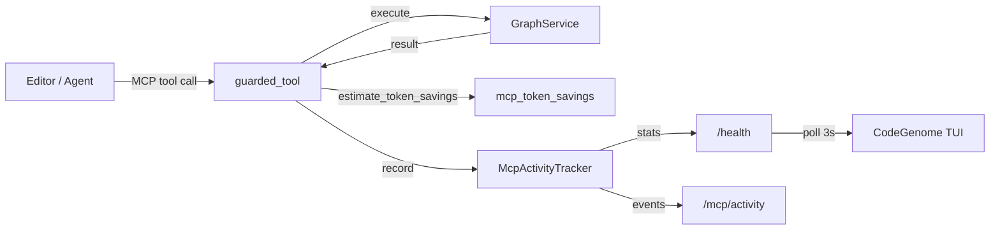

# MCP Activity Tracking and Token Savings

Design note for observability of CodeGenome MCP tool usage: how many calls the server handles, how large responses are, and how many tokens graph queries save compared to reading raw source files.

This document describes the **implemented** feature (server-side tracking, HTTP exposure, TUI dashboard). Metrics are in-memory for the lifetime of a single MCP server process.

---

## Motivation

Agents using CodeGenome MCP tools receive compact graph JSON instead of opening full files. That reduces context window usage, but the benefit was previously invisible.

This feature answers:

1. **How often** is the MCP server used? (call count, per-tool breakdown)
2. **How much context** does each response cost? (`response_tokens`)
3. **How much context** would have been needed without the graph? (`tokens_saved`)

Together, these metrics support debugging, demos, and future billing or ROI reporting.

---

## Architecture



### Modules

| Module | Role |
|--------|------|
| `mcp_activity.py` | Thread-safe ring buffer and aggregate counters |
| `mcp_token_savings.py` | Heuristic token estimation for responses and file-read alternatives |
| `mcp_tools/guard.py` | Wraps every MCP tool: timing, activity, token metrics, error envelope |
| `mcp_tools/routes.py` | Exposes stats on `/health` and `/mcp/activity` |
| `tui/mcp_stats.py` | Polls `/health` and formats the dashboard stats bar |

### Lifecycle

1. `create_server()` instantiates one `McpActivityTracker` per MCP server process.
2. Each successful tool call runs through `build_guarded_tool()`:
   - Executes the handler via `GraphService.run()`
   - Computes `(response_tokens, tokens_saved)` from the raw result
   - Appends an `ActivityEvent` to the ring buffer
   - Emits a structured `tool_call` log line including token fields
3. Failed calls are still counted in `total_calls` but do not add to token totals.
4. When the MCP process exits, all counters reset.

---

## Activity events

Each recorded event (`ActivityEvent`) contains:

| Field | Description |
|-------|-------------|
| `timestamp` | Unix time of the call |
| `tool` | Tool name (e.g. `search_nodes`) |
| `client` | MCP client identity (`cursor`, `stdio`, etc.) |
| `args` | Summarized arguments (long strings truncated to 120 chars) |
| `status` | `ok` or `error` |
| `duration_ms` | Wall-clock execution time |
| `response_tokens` | Estimated tokens in the JSON payload (successful calls only) |
| `tokens_saved` | Estimated tokens avoided vs. reading source files |
| `error` | Error message when `status` is `error` |

The ring buffer retains the most recent **100** events (`McpActivityTracker.MAX_EVENTS`).

---

## Token estimation

Token counts are **heuristic**, not tied to a specific LLM tokenizer.

### Response tokens

```text
response_tokens = max(1, len(json.dumps(result)) // 4)
```

Uses a chars-per-token ratio of **4**, a common approximation for English/code mixed content.

### Alternative cost (reading files)

The estimator walks the tool result and collects `file_path` values (and `file:` node IDs). For each unique file:

1. Look up `file:{path}` in the graph store.
2. If the node has a `size` attribute (bytes from analyze), use `size // 4`.
3. Otherwise fall back to **1,500 tokens** per file.

If no file paths are found but the result is a list (or dict with `nodes`, `results`, etc.), alternative cost is `item_count × 1,500`.

### Tokens saved

```text
tokens_saved = max(0, alternative_tokens - response_tokens)
```

Negative savings are clamped to zero (some tools return large payloads).

### Accuracy notes

- Estimates improve after `codegenome analyze`, which writes `size` on file nodes.
- Global tools (`get_dead_code`, `get_circular_deps`, …) may reference many files; savings can be large.
- Summary-only responses (`get_graph` without `include_nodes`) may show low or zero savings.
- The heuristic does not account for grep, directory listing, or multi-file reads an agent might otherwise perform.

---

## Aggregate statistics

`McpActivityTracker.stats()` returns:

```json
{
  "total_calls": 12,
  "recent_count": 12,
  "total_tokens_saved": 45800,
  "total_response_tokens": 920,
  "calls_by_tool": {
    "get_neighbors": 4,
    "search_nodes": 8
  },
  "tokens_saved_by_tool": {
    "get_neighbors": 22000,
    "search_nodes": 23800
  },
  "last_call_at": 1749225600.12,
  "last_tool": "search_nodes",
  "last_client": "cursor"
}
```

| Field | Meaning |
|-------|---------|
| `total_calls` | All invocations (success and error) |
| `total_tokens_saved` | Sum of `tokens_saved` for successful calls only |
| `total_response_tokens` | Sum of `response_tokens` for successful calls only |
| `calls_by_tool` | Successful calls grouped by tool name |
| `tokens_saved_by_tool` | Token savings grouped by tool name |

---

## HTTP API

Available when MCP runs with HTTP transport (default port **7331**).

### `GET /health`

Existing health payload now includes `mcp_activity`:

```bash
curl http://127.0.0.1:7331/health
```

```json
{
  "status": "ok",
  "service": "codegenome-mcp",
  "mcp_activity": {
    "total_calls": 3,
    "total_tokens_saved": 4200,
    "total_response_tokens": 180,
    "calls_by_tool": { "get_node": 3 },
    "tokens_saved_by_tool": { "get_node": 4200 }
  }
}
```

### `GET /mcp/activity?limit=50`

Returns aggregate stats plus recent events (newest first):

```bash
curl "http://127.0.0.1:7331/mcp/activity?limit=20"
```

```json
{
  "status": "ok",
  "stats": { "...": "..." },
  "events": [
    {
      "timestamp": 1749225600.12,
      "tool": "search_nodes",
      "client": "cursor",
      "args": { "query": "auth" },
      "status": "ok",
      "duration_ms": 14.2,
      "response_tokens": 85,
      "tokens_saved": 1900,
      "error": null
    }
  ]
}
```

`limit` is clamped to the tracker’s ring buffer size (max 100).

### Stdio transport

Activity is still recorded and written to structured stderr logs. HTTP routes are not available; use log scraping or run HTTP alongside stdio for dashboard visibility.

---

## TUI integration

The CodeGenome TUI (**MCP Server** tab) shows a live stats bar above the log:

```text
MCP calls: 12  |  Tokens saved: 45,800
```

### Behavior

- Polls `http://127.0.0.1:7331/health` every **3 seconds** while the main dashboard is visible.
- Works whether MCP was started from the TUI or externally, as long as the health endpoint is reachable.
- When the server is down, shows placeholders: `MCP calls: —  |  Tokens saved: —  (start MCP HTTP to track usage)`.

### Relevant files

- `tui/app.py` — `#mcp-activity-stats` widget and `background_refresh_mcp_activity_stats()`
- `tui/mcp_stats.py` — `fetch_mcp_health()`, `format_mcp_activity_bar()`
- `tui/styles.py` — `.mcp-activity-stats` styling

---

## Structured logging

Successful tool calls emit JSON log lines on stderr:

```json
{
  "level": "INFO",
  "event": "tool_call",
  "tool": "search_nodes",
  "client": "cursor",
  "args": { "query": "auth" },
  "status": "ok",
  "duration_ms": 12.5,
  "response_tokens": 42,
  "tokens_saved": 900
}
```

---

## Tests

| Test file | Coverage |
|-----------|----------|
| `tests/test_mcp_activity.py` | Tracker ring buffer, token fields in stats/events |
| `tests/test_mcp_token_savings.py` | File path extraction, size-based estimation |
| `tests/test_mcp_server.py` | End-to-end tool call records activity + tokens |
| `tests/test_tui_mcp_stats.py` | Health fetch and stats bar formatting |

Run:

```bash
pytest tests/test_mcp_activity.py tests/test_mcp_token_savings.py tests/test_tui_mcp_stats.py -q
```

---

## Limitations and future work

| Limitation | Possible follow-up |
|------------|-------------------|
| In-memory only; lost on server restart | Persist to SQLite or `.genome/mcp-activity.json` |
| Heuristic tokenizer (chars ÷ 4) | Pluggable tokenizer per model family |
| No per-client token totals in TUI | Add client breakdown to stats bar |
| LAN MCP on non-loopback host | TUI always polls `127.0.0.1:7331` |
| stdio MCP has no HTTP dashboard | Document dual transport or embed stats in TUI subprocess parsing |

---

## Quick start

1. Analyze the workspace so file `size` metadata is populated:

   ```bash
   codegenome analyze --path .
   ```

2. Start the MCP HTTP server:

   ```bash
   codegenome mcp-start --path . --transport http --port 7331 --memory-bounded
   ```

3. Use MCP tools from your editor, then inspect:

   - TUI → **MCP Server** tab (live counters)
   - `curl http://127.0.0.1:7331/health`
   - `curl http://127.0.0.1:7331/mcp/activity`

Counters increment as tools are invoked and reflect cumulative savings for the current server session.
