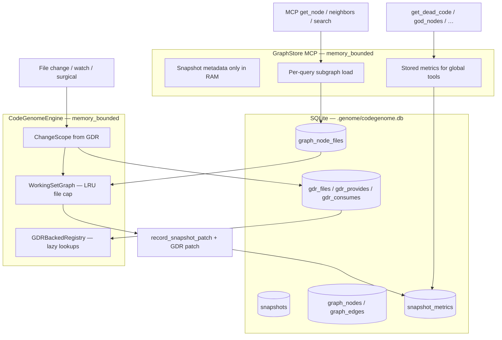

# Memory-Bounded Storage — Current Capabilities

This document describes what CodeGenome **ships today** for memory-bounded storage. It replaces the earlier framing that saving and partial loading of the graph and Global Dependency Registry (GDR) were future work.

**Related docs**

- Design history and schema detail: [`memory-bounded-storage.md`](memory-bounded-storage.md)
- GDR persistence release notes: [`gdr-persistence-and-live-watch-ignore.md`](gdr-persistence-and-live-watch-ignore.md)

---

## Statement addressed

Earlier documentation and paper text described memory-bounded storage this way:

> *The design goal is to load only the graph parts needed for a change. Today, the full graph remains in memory. Saving and partial loading of the graph and GDR is future work.*

**Current status (v0.1.x):** That work is **implemented and available as an opt-in mode**. When memory-bounded mode is enabled, the engine, live evolve server, and MCP server can operate without keeping the full project graph or full GDR resident in RAM. Graph snapshots and GDR are persisted in SQLite and loaded **per file**, **per neighborhood**, or **on demand**.

The **default** code paths (`analyze`, `mcp-start`, `evolve` without flags) still load the full graph for backward compatibility and simplicity. Bounded behavior requires an explicit flag or TUI preset.

---

## What is shipped

| Capability | Module / entry point | Behavior |
|------------|----------------------|----------|
| **GDR persistence** | `gdr_store.py`, `timeline.gdr_store` | Per-snapshot `gdr_files`, `gdr_provides`, `gdr_consumes` in `codegenome.db` |
| **GDR patch deltas** | `GDRStore.persist_snapshot_patch()` | Surgical snapshots update only changed files’ GDR rows |
| **Partial GDR hydrate** | `GDRBackedRegistry` | Lazy `get_provider` / `get_dependents`; `ensure_files()` loads a file scope from disk |
| **Partial graph load** | `timeline.load_file_subgraph()`, `load_neighborhood()` | SQL-backed subgraph loads via `graph_node_files` index |
| **Working set** | `working_set.py` — `WorkingSetGraph` | LRU eviction; default cap 64 files (`--max-working-files`) |
| **Snapshot patch** | `timeline.record_snapshot_patch()` | SQL patch for changed nodes/edges without rewriting the full snapshot |
| **Precomputed global metrics** | `snapshot_metrics.py` | Full-graph `IntelligenceReport` + betweenness stored per snapshot; copied on patch |
| **Bounded engine** | `core.py` — `CodeGenomeConfig.memory_bounded` | Startup evicts graph; surgical/incremental updates use change scope + working set |
| **Bounded MCP** | `graph_store.py` — `memory_bounded=True` | Local queries load subgraphs; global tools read stored metrics |
| **Bounded genome REST** | `genome_sql_provider.py`, `graph_store.py` | `/genome` streams SQL aggregates; module routes load only the selected module |
| **Bounded exports** | `timeline.export_snapshot_json/html()` | HTML/JSON from SQLite rows without `load_snapshot()` |
| **Snapshot lifecycle** | `timeline.prune_snapshots()`, `codegenome db-maintain` | Transactional count/age retention plus optional SQLite compaction |
| **TUI controls** | `tui.py` — Memory Setup Console | Per-service toggles and presets (All Bounded, Evolve Only, MCP Only) |

---

## Architecture (bounded mode)



### In-memory footprint (bounded)

| Component | Default (unbounded) | Memory-bounded |
|-----------|---------------------|----------------|
| Build / evolve graph | Full project graph | Working set only (≤ `max_working_files` files) |
| GDR | Full in-memory maps | `GDRBackedRegistry` — empty start, hydrate on scope |
| MCP `GraphStore` | Full graph after `open()` | Empty graph + snapshot counts; load per query |
| Genome REST routes | Resident full graph | SQL overview + requested module slice only |
| Global intelligence | Recomputed on full graph | Read from `snapshot_metrics` (or opt-in full reload) |

---

## How to enable

### CLI

```bash
# One-shot analyze — full build writes metrics + GDR, then enters bounded working set
codegenome analyze --memory-bounded --max-working-files 64 .

# Live evolve with bounded surgical updates and debounced incremental rebuild
codegenome evolve --live --memory-bounded --max-working-files 64 .

# MCP without full graph in RAM
codegenome mcp-start --memory-bounded .

# MCP global tools: use stored metrics (default) or force live full-graph analysis
codegenome mcp-start --memory-bounded --full-analysis-on-demand

# Retention is automatic (100 snapshots by default); compact in a maintenance window
codegenome db-maintain --retain-snapshots 100 --compact --path .
```

### TUI

Open **Memory Setup Console** from the dashboard (bottom action row). Presets:

| Preset | Analyze | Evolve | MCP |
|--------|---------|--------|-----|
| **All Bounded** | bounded | bounded | bounded |
| **Evolve Only** | full | bounded | full |
| **MCP Only** | full | full | bounded |

Adjust **Max working files** and per-service switches; the console shows the equivalent CLI commands.

### MCP environment variables

| Variable | Purpose |
|----------|---------|
| `CODEGENOME_MCP_MEMORY_BOUNDED` | Enable bounded MCP (`1` / `true`) |
| `CODEGENOME_MCP_MAX_QUERY_NODES` | Cap nodes loaded per neighborhood query |
| `CODEGENOME_MCP_NEIGHBORHOOD_DEPTH` | BFS depth for `get_neighbors` |
| `CODEGENOME_MCP_FULL_ANALYSIS_ON_DEMAND` | Allow temporary full-graph load for global tools |

---

## End-to-end flows

### 1. First bounded analyze (cold start)

1. Scanner + parser run over the workspace (same as full mode).
2. Full graph is built **once** in memory (required to compute correct global metrics).
3. `record_snapshot()` writes nodes, edges, and `graph_node_files` to SQLite.
4. `GDRStore.persist_snapshot()` writes the full registry for that snapshot.
5. `SnapshotMetricsStore.persist_snapshot()` stores dead-code, cycles, god nodes, coupling, complexity, churn, and betweenness from the full-graph analysis.
6. Engine calls `_enter_memory_bounded_mode()` — working set is cleared; only metadata remains hot.

After this, restarts in bounded mode **do not** call `load_snapshot()` for the full graph.

### 2. Surgical file change (bounded evolve)

1. `GDRStore.resolve_change_scope()` computes the minimal file set: changed files + dependents + providers.
2. `WorkingSetGraph.ensure_files(scope)` loads those file subgraphs from SQLite; evicts LRU files beyond the cap.
3. `GDRBackedRegistry.ensure_files(scope)` hydrates only the GDR slice needed for registry updates.
4. `GraphBuilder.update()` mutates the working-set graph for the single-file scan.
5. `record_snapshot_patch()` patches `graph_nodes` / `graph_edges` for the new snapshot id.
6. `persist_snapshot_patch()` updates GDR rows for changed files only.
7. `snapshot_metrics` is **copied** from the base snapshot (global metrics are not recomputed on partial updates).
8. Exports (`graph.json`, `graph.html`) stream from SQLite using the **stored** intelligence report.

### 3. MCP query (bounded)

| Tool class | Memory behavior |
|------------|-----------------|
| `get_node`, `get_neighbors`, `query_graph`, `search_nodes` | Load subgraph from SQLite on demand |
| `get_dead_code`, `get_entry_points`, `get_god_nodes`, `get_circular_deps` | Read precomputed `snapshot_metrics` |
| `get_complexity`, `get_churn`, `get_coupling_metrics`, `get_betweenness_centrality` | Read precomputed rankings |
| `get_graph`, `get_timeline`, `get_changes` | Metadata / SQL only |

If no metrics row exists for the active snapshot, global tools return an error directing the user to run a full `codegenome analyze` first, unless `--full-analysis-on-demand` is set.

### 4. Debounced watch rebuild (bounded)

`CodeGenomeEngine._rebuild_incremental_bounded()` batches filesystem changes: resolves scope, updates working set, patches SQLite and GDR, copies metrics, exports — without reloading the full graph.

---

## SQLite tables (bounded storage)

| Table | Role |
|-------|------|
| `snapshots` | Snapshot metadata (node/edge counts, label, timestamp) |
| `graph_nodes`, `graph_edges` | Full snapshot graph (durable; read partially) |
| `graph_node_files` | File path → node id index for `load_file_subgraph()` |
| `gdr_files` | Per-file provides/consumes JSON |
| `gdr_provides` | FQN → provider file |
| `gdr_consumes` | FQN → consuming files |
| `snapshot_metrics` | Serialized `IntelligenceReport` + betweenness rankings |

---

## API reference (key types)

### `GDRStore` / `GDRBackedRegistry`

```python
from codegenome.timeline import GraphTimeline

timeline = GraphTimeline(".genome/codegenome.db")
store = timeline.gdr_store

# Disk lookups (no full hydrate)
provider = store.get_provider(snapshot_id=1, fqn="MyClass.method")
dependents = store.get_dependents(snapshot_id=1, fqn="MyClass.method")

# Change cone for a surgical update
scope = store.resolve_change_scope(
    snapshot_id=1,
    changed_files={"src/foo.py"},
    removed_fqns=set(),
)

# Bounded runtime registry (engine uses this when memory_bounded=True)
backed = store.create_backed_registry(snapshot_id=1)
backed.ensure_files(set(scope.all_files))
```

### `WorkingSetGraph`

```python
from codegenome.working_set import WorkingSetGraph

ws = WorkingSetGraph(timeline, snapshot_id=1, max_files=64)
ws.ensure_files({"src/foo.py", "src/bar.py"})  # loads + LRU evicts
graph = ws.graph  # only resident files’ nodes/edges
```

### `SnapshotMetricsStore`

```python
metrics = timeline.metrics_store.load_snapshot(snapshot_id=1)
if metrics:
    dead = metrics.report.dead_code
    betweenness = metrics.betweenness_rankings
```

---

## Comparison: old statement vs today

| Claim (legacy) | Today |
|----------------|-------|
| Full graph remains in memory | **False when `--memory-bounded` is on** — working set + on-demand MCP loads |
| Saving the graph is future work | **Shipped** — full snapshots + SQL patch snapshots in `codegenome.db` |
| Partial loading is future work | **Shipped** — `load_file_subgraph`, `load_neighborhood`, working set |
| GDR persistence is future work | **Shipped** — snapshot-scoped GDR tables + patch deltas |
| GDR partial load is future work | **Shipped** — `GDRBackedRegistry` with lazy lookups and `ensure_files()` |
| Global analysis needs full graph in RAM | **Mitigated** — precomputed per snapshot; MCP reads stored metrics |

---

## Remaining limitations (honest scope)

These are **not** regressions; they are deliberate trade-offs or follow-up work:

1. **Opt-in, not default** — Unbounded mode is still the default CLI/TUI path. Large repos must explicitly enable bounded mode.

2. **First build is full** — The initial analyze in bounded mode still constructs the entire graph once to populate SQLite, GDR, and global metrics. Bounded mode bounds **steady-state** and **incremental** memory, not the first cold build.

3. **Metrics freshness on patch** — Surgical and incremental bounded updates **copy** metrics from the base snapshot. Dead-code / cycle / god-node results reflect the last **full** build until the user runs `analyze` (full) again. Partial working-set analysis is intentionally not written over global metrics.

4. **Working set cap** — Files outside the LRU window are not in RAM until requested again. Correctness of surgical updates is preserved via scope resolution; localized MCP answers only cover loaded/query regions.

5. **Full-analysis-on-demand cost** — `--full-analysis-on-demand` temporarily loads the entire graph for live recomputation. Use stored metrics when possible.

6. **GDR storage per retained snapshot** — Each retained snapshot owns a full GDR view (with patch optimization for surgical writes). Cross-snapshot GDR deduplication is not implemented, but automatic count/age retention bounds history growth.

7. **Paper / top-of-spec doc lag** — [`memory-bounded-storage.md`](memory-bounded-storage.md) still opens with historical “implementation is future work” language in its introduction; this document is the authoritative **current product** description.

---

## Operational checklist

For a repository that should run bounded end-to-end:

1. Run `codegenome analyze --memory-bounded .` once (creates GDR + metrics for latest snapshot).
2. Start evolve or MCP with matching flags (or TUI **All Bounded** preset).
3. After large structural changes, run full analyze again to refresh global metrics.
4. Tune `--max-working-files` for available RAM (default 64).

---

## Module map

| File | Responsibility |
|------|----------------|
| `src/codegenome/gdr_store.py` | GDR schema, persist/hydrate/patch, `GDRBackedRegistry` |
| `src/codegenome/snapshot_metrics.py` | Global metrics persistence |
| `src/codegenome/timeline.py` | Snapshots, partial load, patch, SQL exports, retention/compaction |
| `src/codegenome/working_set.py` | LRU working-set graph |
| `src/codegenome/graph_loader.py` | Node/file path helpers for partial load |
| `src/codegenome/core.py` | Engine orchestration, bounded surgical/incremental paths |
| `src/codegenome/graph_store.py` | Bounded MCP query layer |
| `src/codegenome/serializers/genome_sql_provider.py` | SQL-projected bounded REST payloads |
| `src/codegenome/intelligence.py` | Analysis + `report_to_dict` / `report_from_dict` |
| `src/codegenome/tui.py` | Memory Setup Console |
| `src/codegenome/cli.py` | Bounded-memory, retention, and database-maintenance controls |

---

## Summary

Memory-bounded storage is **no longer future work**. CodeGenome persists the graph and GDR to SQLite, loads only the subgraph required for a change or query when bounded mode is enabled, and serves global MCP intelligence from precomputed snapshot metrics. Enable it via CLI flags, MCP env vars, or the TUI Memory Setup Console; run one full analyze first so metrics and GDR exist for the active snapshot.
