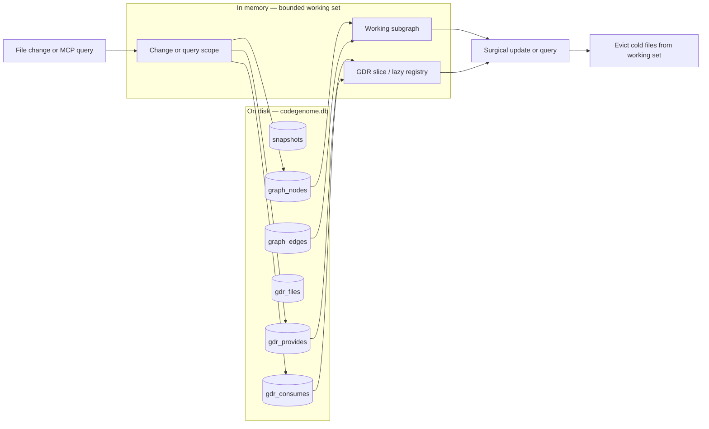

# Memory-Bounded Storage and GDR Persistence

Design note for loading only the graph parts needed for a change, instead of keeping the full project graph and Global Dependency Registry (GDR) in memory at all times.

This document captures the current architecture, the design goal (already stated in `paper/main.tex`, §Limitations and Future Work), a SQLite schema for persisting the GDR, and a Python API sketch for partial loading. **Implementation is future work**; this file is the specification to build against.

---

## Design goal

**Memory-bounded storage** means the engine should hold only the subgraph required for the current operation (a file change, an MCP query, a localized analysis), not the entire project graph plus full GDR reverse indexes.

Today:

- The **full graph** stays in RAM in the build engine, evolve/live server, and MCP `GraphStore`.
- The **GDR** is rebuilt in process during builds and updated incrementally per file; it is **not persisted**.
- SQLite **does** store complete graph snapshots, but `load_snapshot()` always reconstructs **all** nodes and edges.

Saving and partial loading of both the graph and GDR remain the next step toward bounded memory.

---

## Current architecture

### Three in-memory layers

| Layer | Module | Behavior |
|-------|--------|----------|
| Build / evolve | `CodeGenomeEngine` (`core.py`) | `GraphBuilder` holds one graph; `_load_existing_graph()` loads the latest snapshot wholesale on startup. |
| GDR | `GlobalDependencyRegistry` (`registry.py`) | In-memory `files`, `providers`, `consumers` maps; updated via `update_file()` / `remove_file()`. |
| MCP queries | `GraphStore` (`graph_store.py`) | `open()` calls `GraphTimeline.load_snapshot()` and keeps the full igraph resident. |

### Relevant code paths

**Engine loads entire latest snapshot on init:**

```python
# core.py — _load_existing_graph()
self.builder.graph = self.timeline.load_snapshot(latest.snapshot_id)
```

**Timeline always loads all nodes and edges:**

```python
# timeline.py — load_snapshot()
rows = self._conn.execute(
    "SELECT node_id, attrs_json FROM graph_nodes WHERE snapshot_id = ?",
    (snapshot_id,),
).fetchall()
# ... then all edges for snapshot_id ...
```

**GDR is updated after every build/surgical update but never written to disk:**

```python
# core.py — build() / surgical_update()
deleted_fqns.update(self.registry.update_file(path, p_set, consumes.get(path, set())))
for fqn in deleted_fqns:
    for dep_path in self.registry.get_dependents(fqn):
        self._flag_broken_proxy(graph, dep_path, fqn)
```

### What already aligns (but does not bound memory)

| Feature | Benefit | Memory impact |
|---------|---------|---------------|
| Surgical per-file graph update | Only one file’s nodes/edges are removed and rebuilt | Full graph still resident |
| MCP subset tools (`get_neighbors`, `query_graph`) | Compact JSON responses; fewer tokens | Full graph still loaded to answer queries |
| WebSocket deltas in live mode | Browser receives patches, not full graph | Server memory unchanged |
| SQLite snapshot timeline | Durable history; enables future partial reads | Writes full snapshots; reads are all-or-nothing |

### Global analyses that assume a full graph

After each update, these run on the **entire** in-memory graph:

- Leiden community detection (`GraphClusterer`)
- SCC / circular dependency detection
- Dead-code and god-node heuristics (`GraphIntelligence`)
- CBO/LCOM annotation
- Betweenness on the file-level projection

A memory-bounded mode must either defer these, scope them to a loaded region, or use precomputed per-snapshot metadata.

---

## Target architecture



### Phased rollout

| Phase | Deliverable | Unblocks |
|-------|-------------|----------|
| **1** | GDR persistence (schema + `GDRStore`) | Survive process restarts without full rebuild; scope resolution from disk |
| **2** | File-scoped graph load (`load_file_subgraph`) | Load only nodes/edges for one or more files |
| **3** | `WorkingSetGraph` manager | LRU / change-driven eviction; bounded RAM |
| **4** | MCP / engine integration behind a flag | `--memory-bounded` or config toggle |
| **5** | Scoped or deferred global analyses | Safe behavior when full graph is not resident |

Phase 1 is the recommended first implementation; it is self-contained and does not require rewriting `GraphTimeline` or `GraphStore`.

---

## GDR persistence — SQLite schema

Add tables to the existing `codegenome.db` (same connection as `GraphTimeline`). GDR state is tied to a **snapshot** so historical queries stay consistent with graph snapshots.

### Design choices

- **Snapshot-scoped GDR** — Each `record_snapshot()` copies or diffs GDR into tables keyed by `snapshot_id`. Matches the timeline model and avoids “current GDR” drifting from “current graph.”
- **Normalized FQN rows** — Separate `gdr_provides` / `gdr_consumes` tables enable indexed lookups (`get_dependents`, `get_provider`) without loading all files.
- **Optional denormalized cache** — `gdr_files` stores JSON blobs for fast per-file load; can be rebuilt from normalized rows if omitted in v1.

### DDL (migration v2)

```sql
-- Applied via GraphTimeline._initialize_schema() or a one-shot migration.

CREATE TABLE IF NOT EXISTS gdr_files (
    snapshot_id   INTEGER NOT NULL,
    file_path     TEXT    NOT NULL,
    provides_json TEXT    NOT NULL,  -- JSON array of FQN strings, sorted
    consumes_json TEXT    NOT NULL,  -- JSON array of consume strings, sorted
    updated_at    REAL    NOT NULL,
    PRIMARY KEY (snapshot_id, file_path),
    FOREIGN KEY (snapshot_id) REFERENCES snapshots(snapshot_id) ON DELETE CASCADE
);

CREATE TABLE IF NOT EXISTS gdr_provides (
    snapshot_id INTEGER NOT NULL,
    fqn         TEXT    NOT NULL,
    file_path   TEXT    NOT NULL,
    PRIMARY KEY (snapshot_id, fqn),
    FOREIGN KEY (snapshot_id) REFERENCES snapshots(snapshot_id) ON DELETE CASCADE
);

CREATE TABLE IF NOT EXISTS gdr_consumes (
    snapshot_id INTEGER NOT NULL,
    fqn         TEXT    NOT NULL,
    file_path   TEXT    NOT NULL,
    PRIMARY KEY (snapshot_id, fqn, file_path),
    FOREIGN KEY (snapshot_id) REFERENCES snapshots(snapshot_id) ON DELETE CASCADE
);

CREATE INDEX IF NOT EXISTS idx_gdr_consumes_lookup
    ON gdr_consumes (snapshot_id, fqn);

CREATE INDEX IF NOT EXISTS idx_gdr_provides_file
    ON gdr_provides (snapshot_id, file_path);

CREATE INDEX IF NOT EXISTS idx_gdr_consumes_file
    ON gdr_consumes (snapshot_id, file_path);

CREATE INDEX IF NOT EXISTS idx_gdr_files_snapshot
    ON gdr_files (snapshot_id);
```

### Write path

On `record_snapshot(graph, label=...)` (or immediately after in `CodeGenomeEngine`):

1. Insert snapshot row (existing).
2. Insert graph nodes/edges (existing).
3. **New:** `GDRStore.persist_snapshot(snapshot_id, registry)` — bulk insert from in-memory `GlobalDependencyRegistry`.

For incremental builds, the engine already has an up-to-date in-memory registry; persistence is a snapshot at commit time, not a live dual-write during editing.

### Read path (partial)

| Query | SQL pattern |
|-------|-------------|
| Provider for FQN | `SELECT file_path FROM gdr_provides WHERE snapshot_id = ? AND fqn = ?` |
| Dependents of FQN | `SELECT file_path FROM gdr_consumes WHERE snapshot_id = ? AND fqn = ?` |
| File entry | `SELECT provides_json, consumes_json FROM gdr_files WHERE snapshot_id = ? AND file_path = ?` |
| All files in scope | `SELECT file_path FROM gdr_files WHERE snapshot_id = ? AND file_path IN (...)` |

### Storage estimate

Per snapshot, row count scales with:

- `|files|` rows in `gdr_files`
- `|provides|` rows in `gdr_provides` (one per unique provided FQN)
- `|consumes|` rows in `gdr_consumes` (one per file–consume pair)

For large monorepos, consider **GDR deltas** in a later revision (only changed files per snapshot). Phase 1 accepts full copy per snapshot for simplicity; snapshot retention policy can prune old GDR rows with old snapshots.

---

## Partial graph loading — SQLite extensions

Extend `GraphTimeline` (or a new `GraphLoader` module) with file-scoped reads. Node IDs follow existing conventions: `file:{path}`, `symbol:{path}:{fqn}`, etc. (`builder.file_node_id`).

### File membership predicate

A node belongs to file `F` if:

- `node_id = 'file:' || F`, or
- `node_id` starts with `'symbol:' || F || ':'`, or
- `node_id` starts with `'proxy:' || F || ':'`, or
- attrs JSON contains `"file": F` (fallback for import/other nodes)

Store `file_path` in node attrs at build time where possible to simplify SQL (future builder change). Until then, use prefix matching in application code.

### DDL helper (optional, phase 2+)

```sql
CREATE TABLE IF NOT EXISTS graph_node_files (
    snapshot_id INTEGER NOT NULL,
    node_id     TEXT    NOT NULL,
    file_path   TEXT    NOT NULL,
    PRIMARY KEY (snapshot_id, node_id),
    FOREIGN KEY (snapshot_id) REFERENCES snapshots(snapshot_id) ON DELETE CASCADE
);

CREATE INDEX IF NOT EXISTS idx_graph_node_files_path
    ON graph_node_files (snapshot_id, file_path);
```

Populated at snapshot write time from node attrs / ID parsing. Enables:

```sql
SELECT node_id, attrs_json FROM graph_nodes n
JOIN graph_node_files f USING (snapshot_id, node_id)
WHERE f.snapshot_id = ? AND f.file_path = ?;
```

### Edge loading

After collecting node IDs for scope `S`:

```sql
SELECT source_id, target_id, attrs_json
FROM graph_edges
WHERE snapshot_id = ?
  AND source_id IN (...)
  AND target_id IN (...);
```

Include **cross-file edges** where one endpoint is in scope and the other is a proxy or resolved symbol in a dependent file (expand scope via GDR before loading edges).

---

## API sketch

New module: `src/codegenome/gdr_store.py`. Partial graph loading can live in `timeline.py` or `graph_loader.py`.

### Data types

```python
@dataclass(frozen=True)
class GDRFileEntry:
    file_path: str
    provides: frozenset[str]
    consumes: frozenset[str]

@dataclass(frozen=True)
class ChangeScope:
    """Files that must be resident for a surgical update."""
    changed: frozenset[str]      # directly edited / deleted
    dependents: frozenset[str]   # files that consume removed/changed FQNs
    providers: frozenset[str]    # files that provide FQNs referenced by changed files

    @property
    def all_files(self) -> frozenset[str]:
        return self.changed | self.dependents | self.providers
```

### `GDRStore`

```python
class GDRStore:
    """Persist and query snapshot-scoped GDR data in codegenome.db."""

    def __init__(self, conn: sqlite3.Connection) -> None: ...

    def initialize_schema(self) -> None:
        """Create gdr_* tables if missing (idempotent)."""

    def persist_snapshot(
        self,
        snapshot_id: int,
        registry: GlobalDependencyRegistry,
    ) -> None:
        """Write full GDR state for snapshot_id. Called after record_snapshot."""

    def load_file(
        self,
        snapshot_id: int,
        file_path: str,
    ) -> GDRFileEntry | None:
        """Load provides/consumes for one file."""

    def get_provider(self, snapshot_id: int, fqn: str) -> str | None: ...

    def get_dependents(self, snapshot_id: int, fqn: str) -> set[str]: ...

    def resolve_change_scope(
        self,
        snapshot_id: int,
        *,
        changed_files: set[str],
        removed_fqns: set[str],
        new_consumes: dict[str, set[str]],  # file -> consume strings
    ) -> ChangeScope:
        """Use GDR tables to compute minimal file set for an update."""

    def hydrate_registry(
        self,
        snapshot_id: int,
        file_paths: set[str] | None = None,
    ) -> GlobalDependencyRegistry:
        """Build in-memory registry from disk.

        If file_paths is None, load all files (equivalent to today).
        If file_paths is a set, load only those entries plus reverse maps
        for FQNs mentioned in their provides/consumes (lazy expansion).
        """
```

### `GlobalDependencyRegistry` adapter (minimal change)

Keep the existing in-memory API. Add optional backing store:

```python
class GlobalDependencyRegistry:
    def __init__(self, *, store: GDRStore | None = None, snapshot_id: int | None = None) -> None:
        self._store = store
        self._snapshot_id = snapshot_id
        # existing: self.files, self.providers, self.consumers

    def ensure_file_loaded(self, file_path: str) -> None:
        """No-op today; with store, load gdr_files row and merge into maps."""

    def flush_to_store(self) -> None:
        """Called before persist_snapshot if dual-write during session."""
```

Phase 1: engine calls `GDRStore.persist_snapshot` after each build; no lazy load yet.

### `GraphTimeline` extensions

```python
class GraphTimeline:
    # existing methods ...

    def load_file_subgraph(
        self,
        snapshot_id: int,
        file_paths: set[str],
        *,
        include_cross_edges: bool = True,
    ) -> Graph:
        """Load nodes for file_paths and edges with both endpoints in loaded nodes."""

    def load_neighborhood(
        self,
        snapshot_id: int,
        seed_node_id: str,
        *,
        depth: int = 1,
        max_nodes: int = 500,
    ) -> Graph:
        """BFS expansion for MCP get_neighbors-style queries."""
```

### `WorkingSetGraph` (phase 3)

```python
class WorkingSetGraph:
    """Bounded in-memory graph backed by timeline + GDR on disk."""

    def __init__(
        self,
        timeline: GraphTimeline,
        gdr_store: GDRStore,
        snapshot_id: int,
        *,
        max_files: int = 64,
    ) -> None: ...

    @property
    def graph(self) -> Graph:
        """Union of all currently loaded file subgraphs."""

    def ensure_files(self, file_paths: set[str]) -> None:
        """Load missing files; evict LRU cold files if over max_files."""

    def apply_surgical_update(
        self,
        file_path: str,
        scan: ScanResult,
        parses: dict[str, ParseResult],
        builder: GraphBuilder,
    ) -> tuple[Graph, set[str], dict[str, set[str]], dict[str, set[str]]]:
        """Resolve scope, ensure_files, delegate to builder.update on subgraph."""

    def evict_all(self) -> None:
        """Drop resident subgraphs (memory pressure / snapshot switch)."""
```

### `GraphStore` bounded mode (phase 4)

```python
class GraphStore:
    def __init__(
        self,
        db_path: Path | str,
        *,
        memory_bounded: bool = False,
        max_query_nodes: int = 500,
    ) -> None: ...

    def open(self) -> None:
        if self._memory_bounded:
            # Load snapshot metadata only; _graph starts empty
            self._snapshot_id = latest.snapshot_id
            self._graph = create_graph("igraph")
        else:
            # existing: load_snapshot(latest)
            ...

    def _ensure_neighborhood(self, node_id: str, depth: int = 1) -> None:
        """Load into working set before intelligence queries."""
```

### Engine integration (phase 1 — persist only)

```python
# core.py — after timeline.record_snapshot(...)
snapshot_id = self.timeline.record_snapshot(graph, label=label)
self._gdr_store.persist_snapshot(snapshot_id, self.registry)
```

On startup with existing DB, optionally rebuild registry from latest snapshot:

```python
def _load_existing_registry(self, snapshot_id: int) -> None:
    self.registry = self._gdr_store.hydrate_registry(snapshot_id)
```

---

## Change-scope resolution algorithm

Used by surgical update and future bounded rebuilds.

```
Input: changed_files C, snapshot_id S, GDRStore G
Output: ChangeScope

1. removed_fqns ← FQNs no longer provided by files in C (from update diff)
2. D ← ∅
3. For each fqn in removed_fqns:
       D ← D ∪ G.get_dependents(S, fqn)
4. P ← ∅
5. For each file f in C:
       entry ← G.load_file(S, f) or in-memory registry entry
       For each consume string k in entry.consumes:
           provider ← G.get_provider(S, k)
           if provider: P ← P ∪ {provider}
6. Return ChangeScope(changed=C, dependents=D, providers=P)
```

Load graph nodes for `ChangeScope.all_files` before running `builder.update()`.

---

## Migration and compatibility

| Concern | Approach |
|---------|----------|
| Existing databases without GDR tables | `initialize_schema()` adds tables; first build after upgrade writes GDR for new snapshots only |
| Old snapshots missing GDR | `hydrate_registry()` falls back to full graph rebuild from snapshot or re-analyze workspace |
| API compatibility | Default remains full in-memory graph; bounded mode is opt-in |
| Tests | `tests/test_gdr_store.py` — round-trip persist/load, scope resolution, dependents/provider lookups |

### Suggested `schema_version` table

```sql
CREATE TABLE IF NOT EXISTS schema_meta (
    key   TEXT PRIMARY KEY,
    value TEXT NOT NULL
);
-- INSERT 'timeline_schema_version' = '2' after GDR migration
```

---

## Open questions

1. **GDR per snapshot vs single mutable GDR** — Snapshot-scoped is safer for timeline/MCP history; costs more disk. Mutable “current GDR” is cheaper but complicates `get_changes` / time travel.
2. **When to populate `graph_node_files`** — At write time (recommended) vs parse-on-read from `node_id` prefixes.
3. **Eviction policy** — LRU on files vs “change cone only” (drop everything not in last scope).
4. **Global analyses in bounded mode** — Skip, approximate on loaded region, or run on snapshot metadata computed at full build time.
5. **Proxy / short-name matching** — Scope resolution uses consume strings as stored today; improved symbol resolution (paper limitation §5) affects which dependents are discovered.

---

## Implementation checklist

### Phase 1 — GDR persistence (shipped)

- [x] Add `gdr_store.py` with schema DDL and `persist_snapshot` / `get_provider` / `get_dependents`
- [x] Extend `GraphTimeline._initialize_schema()` or call `GDRStore.initialize_schema()` from timeline init
- [x] Wire `CodeGenomeEngine.build()` and `surgical_update()` to persist GDR after `record_snapshot`
- [x] Add `_load_existing_registry()` on engine startup
- [x] Unit tests for round-trip and scope resolution

### Phase 2–3 — Partial graph load and working set (shipped)

- [x] `graph_node_files` index populated at `record_snapshot`
- [x] `GraphTimeline.load_file_subgraph()` and `load_neighborhood()`
- [x] `GraphTimeline.record_snapshot_patch()` for SQL-backed surgical persistence
- [x] `WorkingSetGraph` with LRU file eviction
- [x] `CodeGenomeConfig.memory_bounded` and `evolve --memory-bounded`
- [x] Surgical updates use GDR scope + working set when memory-bounded

### Phase 4 — bounded MCP (shipped)

- [x] `GraphStore(memory_bounded=True)` keeps snapshot metadata only at startup
- [x] `get_node`, `get_neighbors`, `query_graph`, `search_nodes` use SQL/subgraph loads
- [x] `codegenome mcp-start --memory-bounded` and env vars (`CODEGENOME_MCP_MEMORY_BOUNDED`, etc.)
- [x] Optional `--full-analysis-on-demand` for global MCP tools

### Phase 5 — scoped surgical analysis (partial)

- [x] Bounded surgical updates analyze the working set only (no full-graph reload)
- [x] `timeline.export_snapshot_json()` writes `graph.json` from SQLite rows
- [x] `timeline.export_snapshot_html()` defers node data to sidecar `graph.json` (no `load_snapshot()`)
- [x] `GDRStore.persist_snapshot_patch()` for snapshot-scoped GDR deltas
- [x] `_rebuild_incremental_bounded()` for memory-bounded debounced watch rebuilds

See [`gdr-persistence-and-live-watch-ignore.md`](gdr-persistence-and-live-watch-ignore.md) for release notes.

---

## References

- `paper/main.tex` — §Memory Behaviour, §Limitations and Future Work (item: Memory-bounded storage)
- `src/codegenome/registry.py` — in-memory GDR
- `src/codegenome/timeline.py` — snapshot persistence
- `src/codegenome/core.py` — build, surgical update, registry updates
- `src/codegenome/graph_store.py` — MCP full-graph load
